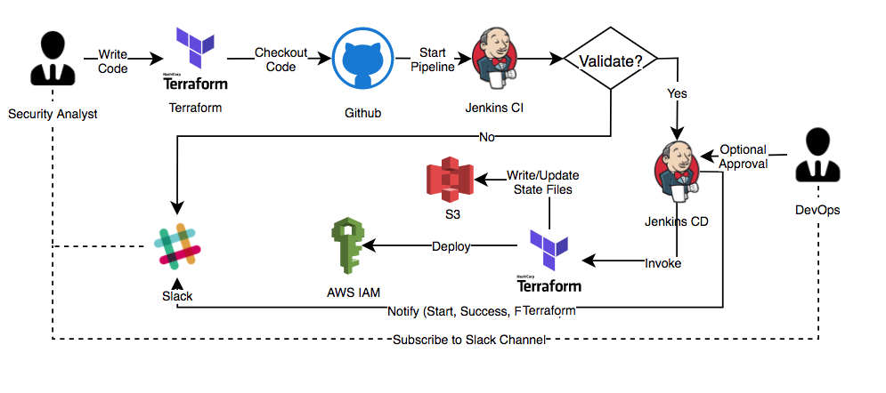
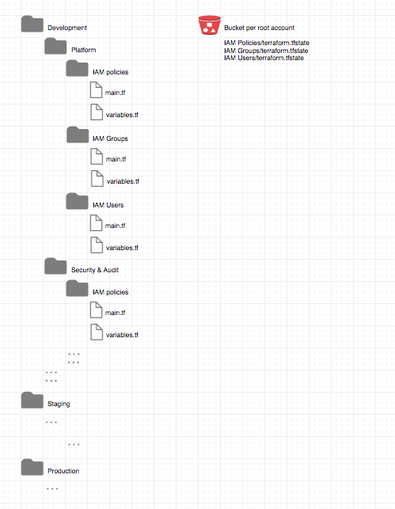

# Create IAM policies, Groups and Users using Terraform
-------------------------------------------------------

&nbsp;&nbsp;&nbsp;&nbsp; Example below demonstrates end to end flow of how to manage Security as a Code using Terraform for IAM and use CI/CD pipeline to automate, integrate, deploy and notify using Jenkins pipeline and Slack.

## Prerequisites
----------------

&nbsp;&nbsp;&nbsp;&nbsp;1. Jenkins PATH variable configuration, plugin install, webhooks, git and slack integration


## Security As A Code and CI/CD pipeline



## Terraform Folder/File Structure



## Reverse engineer existing resources in terraform CloudFormation
------------------------------------------------------------------

Use following github to reverse engineer existing resources.  
https://github.com/dtan4/terraforming  
  
## Terraform Configuration files
--------------------------------

Policies Configuration and Variables file  
&nbsp;&nbsp;&nbsp;&nbsp;Policies/main.tf  
&nbsp;&nbsp;&nbsp;&nbsp;Policies/variables.tf    

Groups Configuration and Variables file  
&nbsp;&nbsp;&nbsp;&nbsp;Groups/main.tf  
&nbsp;&nbsp;&nbsp;&nbsp;Groups/variables.tf  

Users Configuration and Variables files  
&nbsp;&nbsp;&nbsp;&nbsp;Users/main.tf  
&nbsp;&nbsp;&nbsp;&nbsp;Users/variables.tf  

How to run?  
&nbsp;&nbsp;&nbsp;&nbsp;cd <folder>  
&nbsp;&nbsp;&nbsp;&nbsp;terraform init  
&nbsp;&nbsp;&nbsp;&nbsp;terraform plan  
&nbsp;&nbsp;&nbsp;&nbsp;terraform apply  

## Jenkins CI/CD pipeline code example
--------------------------------------
  
&nbsp;&nbsp;&nbsp;&nbsp;TerraformIAM/files/Jenkins_IAM_pipeline.jdp
  
## Command outputs (Terraform only):<br>
----------------------------------------
  ````
  C:\Policies>terraform init

  Initializing the backend...

  Successfully configured the backend "s3"! Terraform will automatically
  use this backend unless the backend configuration changes.

  Initializing provider plugins...
  - Checking for available provider plugins on https://releases.hashicorp.com...
  - Downloading plugin for provider "aws" (1.6.0)...

  The following providers do not have any version constraints in configuration,
  so the latest version was installed.

  To prevent automatic upgrades to new major versions that may contain breaking
  changes, it is recommended to add version = "..." constraints to the
  corresponding provider blocks in configuration, with the constraint strings
  suggested below.

  * provider.aws: version = "~> 1.6"

  Terraform has been successfully initialized!

  You may now begin working with Terraform. Try running "terraform plan" to see
  any changes that are required for your infrastructure. All Terraform commands
  should now work.

  If you ever set or change modules or backend configuration for Terraform,
  rerun this command to reinitialize your working directory. If you forget, other
  commands will detect it and remind you to do so if necessary.

  C:\Policies>terraform plan
  Refreshing Terraform state in-memory prior to plan...
  The refreshed state will be used to calculate this plan, but will not be
  persisted to local or remote state storage.


  ------------------------------------------------------------------------

  An execution plan has been generated and is shown below.
  Resource actions are indicated with the following symbols:
    + create

  Terraform will perform the following actions:

    + aws_iam_policy._APIGatewayDescribeStacks
        id:          <computed>
        arn:         <computed>
        description: "Enables API Gateway to call AWS services"
        name:        "_APIGatewayDescribeStacks"
        path:        "/"
        policy:      "{\n  \"Version\": \"2012-10-17\",\n  \"Statement\": [\n    {\n      \"Effect\": \"Allow\",\n      \"Resource\": [\n        \"*\"\n      ],\n      \"Action\": [\n        \"cloudformation:DescribeStacks\"\n      ]\n    }\n  ]\n}\n"

    + aws_iam_policy._ApiAuthorization
        id:          <computed>
        arn:         <computed>
        name:        "_ApiAuthorization"
        path:        "/"
        policy:      "{\n  \"Version\": \"2012-10-17\",\n  \"Statement\": [\n    {\n      \"Effect\": \"Allow\",\n      \"Action\": [\n        \"execute-api:*\"\n      ],\n      \"Resource\": [\n        \"arn:aws:execute-api:us-east-1:890403726045:gsyse03ukd/dev/*/*\"\n      ]\n    }\n  ]\n}\n"


  Plan: 2 to add, 0 to change, 0 to destroy.

  ------------------------------------------------------------------------

  Note: You didn't specify an "-out" parameter to save this plan, so Terraform
  can't guarantee that exactly these actions will be performed if
  "terraform apply" is subsequently run.


  C:\Policies>terraform apply

  An execution plan has been generated and is shown below.
  Resource actions are indicated with the following symbols:
    + create

  Terraform will perform the following actions:

    + aws_iam_policy._APIGatewayDescribeStacks
        id:          <computed>
        arn:         <computed>
        description: "Enables API Gateway to call AWS services"
        name:        "_APIGatewayDescribeStacks"
        path:        "/"
        policy:      "{\n  \"Version\": \"2012-10-17\",\n  \"Statement\": [\n    {\n      \"Effect\": \"Allow\",\n      \"Resource\": [\n        \"*\"\n      ],\n      \"Action\": [\n        \"cloudformation:DescribeStacks\"\n      ]\n    }\n  ]\n}\n"

    + aws_iam_policy._ApiAuthorization
        id:          <computed>
        arn:         <computed>
        name:        "_ApiAuthorization"
        path:        "/"
        policy:      "{\n  \"Version\": \"2012-10-17\",\n  \"Statement\": [\n    {\n      \"Effect\": \"Allow\",\n      \"Action\": [\n        \"execute-api:*\"\n      ],\n      \"Resource\": [\n        \"arn:aws:execute-api:us-east-1:890403726045:gsyse03ukd/dev/*/*\"\n      ]\n    }\n  ]\n}\n"


  Plan: 2 to add, 0 to change, 0 to destroy.

  Do you want to perform these actions?
    Terraform will perform the actions described above.
    Only 'yes' will be accepted to approve.

    Enter a value: yes

  aws_iam_policy._APIGatewayDescribeStacks: Creating...
    arn:         "" => "<computed>"
    description: "" => "Enables API Gateway to call AWS services"
    name:        "" => "_APIGatewayDescribeStacks"
    path:        "" => "/"
    policy:      "" => "{\n  \"Version\": \"2012-10-17\",\n  \"Statement\": [\n    {\n      \"Effect\": \"Allow\",\n      \"Resource\": [\n        \"*\"\n      ],\n      \"Action\": [\n        \"cloudformation:DescribeStacks\"\n      ]\n    }\n  ]\n}\n"
  aws_iam_policy._ApiAuthorization: Creating...
    arn:    "" => "<computed>"
    name:   "" => "_ApiAuthorization"
    path:   "" => "/"
    policy: "" => "{\n  \"Version\": \"2012-10-17\",\n  \"Statement\": [\n    {\n      \"Effect\": \"Allow\",\n      \"Action\": [\n        \"execute-api:*\"\n      ],\n      \"Resource\": [\n        \"arn:aws:execute-api:us-east-1:890403726045:gsyse03ukd/dev/*/*\"\n      ]\n    }\n  ]\n}\n"
  aws_iam_policy._APIGatewayDescribeStacks: Creation complete after 0s (ID: arn:aws:iam::084009911244:policy/_APIGatewayDescribeStacks)
  aws_iam_policy._ApiAuthorization: Creation complete after 0s (ID: arn:aws:iam::084009911244:policy/_ApiAuthorization)

  Apply complete! Resources: 2 added, 0 changed, 0 destroyed.


  ################################################################################################################################################

  C:\Groups>terraform apply

  An execution plan has been generated and is shown below.
  Resource actions are indicated with the following symbols:
    + create

  Terraform will perform the following actions:

    + aws_iam_group.Group1
        id:                <computed>
        arn:               <computed>
        name:              "Group1"
        path:              "/"
        unique_id:         <computed>

    + aws_iam_group.Group2
        id:                <computed>
        arn:               <computed>
        name:              "Group2"
        path:              "/"
        unique_id:         <computed>

    + aws_iam_policy_attachment._APIGatewayDescribeStacks-policy-attachment
        id:                <computed>
        groups.#:          "1"
        groups.4128918848: "Group2"
        name:              "_APIGatewayDescribeStacks-policy-attachment"
        policy_arn:        "arn:aws:iam::084009911244:policy/_APIGatewayDescribeStacks"

    + aws_iam_policy_attachment._ApiAuthorization-policy-attachment
        id:                <computed>
        groups.#:          "1"
        groups.1863523578: "Group1"
        name:              "_ApiAuthorization-policy-attachment"
        policy_arn:        "arn:aws:iam::084009911244:policy/_ApiAuthorization"


  Plan: 4 to add, 0 to change, 0 to destroy.

  Do you want to perform these actions?
    Terraform will perform the actions described above.
    Only 'yes' will be accepted to approve.

    Enter a value: yes

  aws_iam_group.Group1: Creating...
    arn:       "" => "<computed>"
    name:      "" => "Group1"
    path:      "" => "/"
    unique_id: "" => "<computed>"
  aws_iam_group.Group2: Creating...
    arn:       "" => "<computed>"
    name:      "" => "Group2"
    path:      "" => "/"
    unique_id: "" => "<computed>"
  aws_iam_group.Group1: Creation complete after 0s (ID: Group1)
  aws_iam_policy_attachment._ApiAuthorization-policy-attachment: Creating...
    groups.#:          "" => "1"
    groups.1863523578: "" => "Group1"
    name:              "" => "_ApiAuthorization-policy-attachment"
    policy_arn:        "" => "arn:aws:iam::084009911244:policy/_ApiAuthorization"
  aws_iam_group.Group2: Creation complete after 0s (ID: Group2)
  aws_iam_policy_attachment._APIGatewayDescribeStacks-policy-attachment: Creating...
    groups.#:          "" => "1"
    groups.4128918848: "" => "Group2"
    name:              "" => "_APIGatewayDescribeStacks-policy-attachment"
    policy_arn:        "" => "arn:aws:iam::084009911244:policy/_APIGatewayDescribeStacks"
  aws_iam_policy_attachment._ApiAuthorization-policy-attachment: Creation complete after 1s (ID: _ApiAuthorization-policy-attachment)
  aws_iam_policy_attachment._APIGatewayDescribeStacks-policy-attachment: Creation complete after 1s (ID: _APIGatewayDescribeStacks-policy-attachment)

  Apply complete! Resources: 4 added, 0 changed, 0 destroyed.


  ################################################################################################################################################


  C:\Users>terraform plan
  Refreshing Terraform state in-memory prior to plan...
  The refreshed state will be used to calculate this plan, but will not be
  persisted to local or remote state storage.


  ------------------------------------------------------------------------

  An execution plan has been generated and is shown below.
  Resource actions are indicated with the following symbols:
    + create

  Terraform will perform the following actions:

    + aws_iam_group_membership.Group1
        id:              <computed>
        group:           "Group1"
        name:            "Group1-group-membership"
        users.#:         "1"
        users.206540131: "vdesai1,vdesai2"

    + aws_iam_group_membership.Group2
        id:              <computed>
        group:           "Group2"
        name:            "Group2-group-membership"
        users.#:         "1"
        users.879142895: "huahsin1,huahsin2"

    + aws_iam_user.Users_Group1
        id:              <computed>
        arn:             <computed>
        force_destroy:   "false"
        name:            "vdesai1,vdesai2"
        path:            "/"
        unique_id:       <computed>

    + aws_iam_user.Users_Group2
        id:              <computed>
        arn:             <computed>
        force_destroy:   "false"
        name:            "huahsin1,huahsin2"
        path:            "/"
        unique_id:       <computed>


  Plan: 4 to add, 0 to change, 0 to destroy.

  ------------------------------------------------------------------------

  Note: You didn't specify an "-out" parameter to save this plan, so Terraform
  can't guarantee that exactly these actions will be performed if
  "terraform apply" is subsequently run.


  C:\Users>terraform apply

  An execution plan has been generated and is shown below.
  Resource actions are indicated with the following symbols:
    + create

  Terraform will perform the following actions:

    + aws_iam_group_membership.Group1
        id:              <computed>
        group:           "Group1"
        name:            "Group1-group-membership"
        users.#:         "1"
        users.206540131: "vdesai1,vdesai2"

    + aws_iam_group_membership.Group2
        id:              <computed>
        group:           "Group2"
        name:            "Group2-group-membership"
        users.#:         "1"
        users.879142895: "huahsin1,huahsin2"

    + aws_iam_user.Users_Group1
        id:              <computed>
        arn:             <computed>
        force_destroy:   "false"
        name:            "vdesai1,vdesai2"
        path:            "/"
        unique_id:       <computed>

    + aws_iam_user.Users_Group2
        id:              <computed>
        arn:             <computed>
        force_destroy:   "false"
        name:            "huahsin1,huahsin2"
        path:            "/"
        unique_id:       <computed>


  Plan: 4 to add, 0 to change, 0 to destroy.

  Do you want to perform these actions?
    Terraform will perform the actions described above.
    Only 'yes' will be accepted to approve.

    Enter a value: yes

  aws_iam_user.Users_Group2: Creating...
    arn:           "" => "<computed>"
    force_destroy: "" => "false"
    name:          "" => "huahsin1,huahsin2"
    path:          "" => "/"
    unique_id:     "" => "<computed>"
  aws_iam_user.Users_Group1: Creating...
    arn:           "" => "<computed>"
    force_destroy: "" => "false"
    name:          "" => "vdesai1,vdesai2"
    path:          "" => "/"
    unique_id:     "" => "<computed>"
  aws_iam_user.Users_Group1: Creation complete after 0s (ID: vdesai1,vdesai2)
  aws_iam_group_membership.Group1: Creating...
    group:           "" => "Group1"
    name:            "" => "Group1-group-membership"
    users.#:         "" => "1"
    users.206540131: "" => "vdesai1,vdesai2"
  aws_iam_user.Users_Group2: Creation complete after 0s (ID: huahsin1,huahsin2)
  aws_iam_group_membership.Group2: Creating...
    group:           "" => "Group2"
    name:            "" => "Group2-group-membership"
    users.#:         "" => "1"
    users.879142895: "" => "huahsin1,huahsin2"
  aws_iam_group_membership.Group2: Creation complete after 0s (ID: Group2-group-membership)
  aws_iam_group_membership.Group1: Creation complete after 0s (ID: Group1-group-membership)

  Apply complete! Resources: 4 added, 0 changed, 0 destroyed.
  ````
